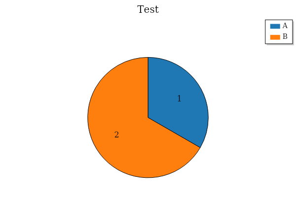
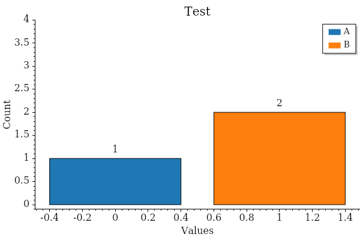
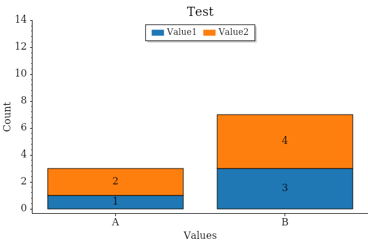

<!-- ********** DO NOT EDIT THESE LINKS ********** -->
<p align="center">
    <a href="https://www.asbuiltreport.com/" alt="AsBuiltReport"></a>
            </a>
</p>
<p align="center">
    <a href="https://www.powershellgallery.com/packages/AsBuiltReport.Chart/" alt="PowerShell Gallery Version">
        </a>
    <a href="https://www.powershellgallery.com/packages/AsBuiltReport.Chart/" alt="PS Gallery Downloads">
        </a>
    <a href="https://www.powershellgallery.com/packages/AsBuiltReport.Chart/" alt="PS Platform">
        </a>
</p>
<p align="center">
    <a href="https://github.com/AsBuiltReport/AsBuiltReport.Chart/graphs/commit-activity" alt="GitHub Last Commit">
        </a>
    <a href="https://raw.githubusercontent.com/AsBuiltReport/AsBuiltReport.Chart/master/LICENSE" alt="GitHub License">
        </a>
    <a href="https://github.com/AsBuiltReport/AsBuiltReport.Chart/graphs/contributors" alt="GitHub Contributors">
        </a>
</p>
<p align="center">
    <a href="https://twitter.com/AsBuiltReport" alt="Twitter">
            </a>
</p>

<p align="center">
    <a href='https://ko-fi.com/B0B7DDGZ7' target='_blank'></a>
</p>
<!-- ********** DO NOT EDIT THESE LINKS ********** -->

# AsBuiltReport.Chart

<!-- ********** REMOVE THIS MESSAGE WHEN THE MODULE IS FUNCTIONAL ********** -->
## :exclamation: THIS ASBUILTREPORT MODULE IS CURRENTLY IN DEVELOPMENT AND MIGHT NOT YET BE FUNCTIONAL ❗

AsBuiltReport.Chart is a PowerShell module which provides a set of cmdlets for generating charts and visualizations in As Built Reports. This module is designed to work seamlessly with the AsBuiltReport.Core module, allowing users to create visually appealing and informative reports with ease.

# :beginner: Getting Started

The following simple list of instructions will get you started with the AsBuiltReport.Chart module.

## :floppy_disk: Supported Versions
<!-- ********** Update supported Chart versions ********** -->

### PowerShell

This report is compatible with the following PowerShell versions;

<!-- ********** Update supported PowerShell versions ********** -->
| Windows PowerShell 5.1 |    PowerShell 7    |
| :--------------------: | :----------------: |
|   :white_check_mark:   | :white_check_mark: |

## 🗺️ Language Support
<!-- ********** Update supported languages ********** -->
The AsBuiltReport Chart supports the following languages;

- English (US) (Default)

## :wrench: System Requirements
<!-- ********** Update system requirements ********** -->
PowerShell 5.1 or PowerShell 7, and the following PowerShell modules are required for generating a AsBuiltReport Chart.

- [AsBuiltReport.Core Module](https://www.powershellgallery.com/packages/AsBuiltReport.Core/)

### :closed_lock_with_key: Required Privileges

Local user privilege

## :package: Module Installation

### PowerShell
<!-- ********** Add installation for any additional PowerShell module(s) ********** -->
```powershell
# Install
install-module AsBuiltReport.Chart -Force

# Update
update-module AsBuiltReport.Chart -Force
```

## :computer: Examples
Here are some examples to get you going.

### Pie Chart
```powershell
# Generate a Pie Chart with the title 'Test', values of 1 and 2, labels 'A' and 'B', and export the chart in PNG format. Enable the legend and set the width to 600 pixels, height to 400 pixels, title font size to 20, and label font size to 16.
New-PieChart -Title 'Test' -Values @(1,2) -Labels @('A','B') -Format 'png' -EnableLegend -Width 600 -Height 400 -TitleFontSize 20 -LabelFontSize 16
```


### Bar Chart
```powershell
# Generate a Bar Chart with the title 'Test', values of 1 and 2, labels 'A' and 'B', and export the chart in PNG format. Enable the legend and set the width to 600 pixels, height to 400 pixels, title font size to 20, and label font size to 16.
New-BarChart -Title 'Test' -Values @(1,2) -Labels @('A','B') -Format 'png' -EnableLegend -Width 600 -Height 400 -TitleFontSize 20 -LabelFontSize 16 -AxesMarginsTop 1
```


### Stacked Bar Chart
```powershell
# Generate a Stacked Bar Chart with the title 'Test', values of 1 and 2 for the first category and 3 and 4 for the second category, labels 'A' and 'B', legend categories 'Value1' and 'Value2', and export the chart in PNG format. Enable the legend, set the legend orientation to horizontal, align the legend to the upper center, set the width to 600 pixels, height to 400 pixels, title font size to 20, label font size to 16, and axes margins top to 1.
New-StackedBarChart -Title 'Test' -Values @(@(1,2),@(3,4)) -Labels @('A','B') -LegendCategories @('Value1','Value2') -Format 'png' -EnableLegend -LegendOrientation Horizontal -LegendAlignment UpperCenter -Width 600 -Height 400 -TitleFontSize 20 -LabelFontSize 16 -AxesMarginsTop 1
```


### :blue_book: Example Index

All examples in the latest release of AsBuiltReport.Chart can be found in the table below.

| Name                                 | Description                                          |
| ------------------------------------ | ---------------------------------------------------- |
| [Example1](./Examples/Example01.ps1) | Basic Pie Chart                                      |
| [Example2](./Examples/Example02.ps1) | Pie Chart with Legend, Custom Colors and Border      |
| [Example3](./Examples/Example03.ps1) | Basic Bar Chart                                      |
| [Example4](./Examples/Example04.ps1) | Bar Chart with Advanced Options                      |
| [Example5](./Examples/Example05.ps1) | Basic Stacked Bar Chart                              |
| [Example6](./Examples/Example06.ps1) | Stacked Bar Chart with Advanced Options              |
| [Example7](./Examples/Example07.ps1) | Basic Signal Chart (Line Chart)                      |
| [Example8](./Examples/Example08.ps1) | Signal Chart with DateTime X-Axis (Time-Series Data) |
| [Example9](./Examples/Example09.ps1) | Signal Chart with Multiple Lines                     |

## :x: Known Issues

 - No known issues at this time.


